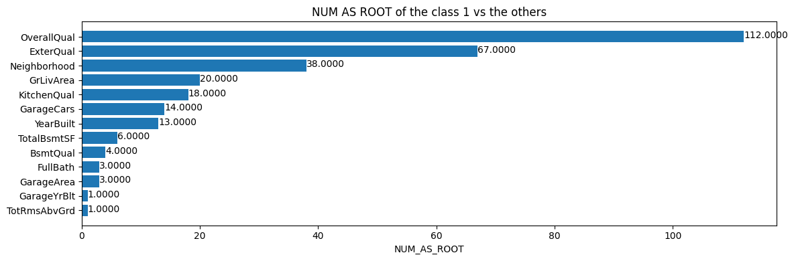

# House Prices Prediction Using TensorFlow
#### Train a Random Forest model using TensorFlow Decision Forests on the House Prices dataset

# Introduction
Predicting house prices is a crucial task as it can offer insights into the economy, inflation, consumption, and demand and supply. With the significant role played by the housing market in the business cycle, studying housing sales and prices is essential. Machine learning has emerged as a popular approach to forecast house prices based on their attributes, enabling policymakers and economists to design better policies and estimate prepayments, housing mortgage, and affordability. Generally, predicting house prices involves a regression problem that machine learning models can address effectively.

# Dataset
In this project, the training dataset consists of 1460 rows, each representing data for a single house, and 80 columns representing various features of those houses. Similarly, the testing dataset contains information for 1461 houses, and 79 attributes are included in this set, with the remaining column to be predicted.

# Method
Using the code skeleton provided by [TensorFlow.org](https://www.tensorflow.org/decision_forests), the Random Forest model was built and evaluated.
```
# Install TF-DF
!pip install tensorflow tensorflow_decision_forests

# Load TF-DF
import tensorflow_decision_forests as tfdf
import pandas as pd

# Load a dataset in a Pandas dataframe.
train_df = pd.read_csv("project/train.csv")
test_df = pd.read_csv("project/test.csv")

# Convert the dataset into a TensorFlow dataset.
train_ds = tfdf.keras.pd_dataframe_to_tf_dataset(train_df, label="my_label")
test_ds = tfdf.keras.pd_dataframe_to_tf_dataset(test_df, label="my_label")

# Train a Random Forest model.
model = tfdf.keras.RandomForestModel()
model.fit(train_ds)

# Summary of the model structure.
model.summary()

# Evaluate the model.
model.evaluate(test_ds)

# Export the model to a SavedModel.
model.save("project/model")
```

# Evaluation
The following images scores the important features in predicting the prices of houses:


On evaluating the model, the scores are as follows:
- MSE:  1085719040.0000
- RMSE: 29268.65837833366

# Summary
In conclusion, machine learning can be a powerful tool in predicting house prices and providing insights into the economy, inflation, consumption, and demand and supply. Using TensorFlow Decision Forests, a Random Forest model was built and evaluated on the House Prices dataset. The model was able to effectively predict house prices with a low MSE and RMSE. The feature importances provided valuable insights into the attributes that most affect house prices. The use of machine learning in predicting house prices can have significant implications for policymakers, economists, and individuals involved in the housing market.
